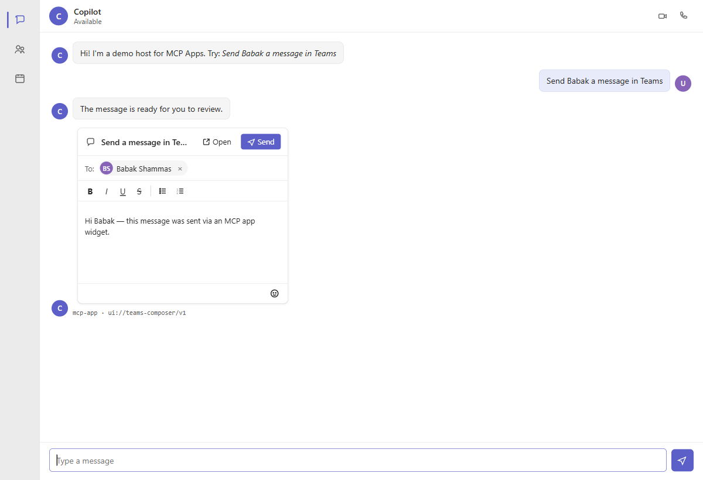

# MCP App Example — "Send a message in Teams"

A runnable demo of the **MCP Apps** pattern: a Teams-styled chatbot renders a
rich interactive widget returned by an MCP tool as a `ui://` resource, and the
widget calls back through the MCP Apps postMessage bridge to invoke a second
tool that (mock-)sends the message via Microsoft Graph.



The screenshot shows the host (`localhost:3000`) after the user typed
*"Send Babak a message in Teams"*. The assistant's text bubble is what a
non-UI MCP host would render; below it, the **composer widget** is a
sandboxed cross-origin iframe served by the MCP server at `localhost:4100` —
a real MCP App, not a mockup. Typing, formatting, and **Send** all stay
inside the iframe; **Send** dispatches a `tools/call` over postMessage,
the host proxies it to the MCP server's `send_message` tool, and the
in-memory Graph mock logs the delivery.

The host now also includes a compact **Bridge Timeline** panel that records
host chat requests, iframe postMessage traffic, and proxied MCP tool calls
with timestamps and payload previews so you can follow the handshake and send
flow end to end.

See `plan.md` for the full design notes.

## Quick start

```sh
# 1. Install dependencies with npm
cd server && npm install
cd ../host && npm install
cd ../e2e && npm install
cd ..

# 2. Start the services with npm
cd server && npm start
cd ../host && npm start

# 3. Open http://localhost:3000 and type: "Send Babak a message in Teams"
```

Optional shell helpers:

```sh
# Install all workspace dependencies
./build.sh

# Start all packages that define npm start
./start.sh
```

`build.sh` is a shortcut for installing dependencies across `server`, `host`,
and `e2e`, and it also runs each package's `build` script when one exists.

`start.sh` is a shortcut for starting every package that defines `npm start`.
It keeps the processes attached and stops them together on `Ctrl+C`.

## What to look for

- The assistant responds with a **"The message is ready for you to review."**
  bubble followed by the Teams-composer widget rendered **inside a sandboxed
  iframe**.
- The iframe origin is `http://localhost:4100` — a real cross-origin embed.
- Typing, toggling bold, and clicking **Send** stays entirely inside the
  widget; no host-side clicks.
- Clicking **Send** fires a `tools/call` over `postMessage`; the host proxies
  it to the MCP server's `send_message` tool, which logs the body through the
  in-memory Graph mock.
- After success the widget shows "Sent ✓" and pushes a `ui/message` that
  appears as a new assistant bubble.
- The **Bridge Timeline** panel on the right shows each host ↔ MCP App hop in
  order with a compact preview and expandable raw details.

## Layout

```
mcp-app-example/
├── plan.md
├── README.md
├── server/         # :4000  MCP JSON-RPC server + widget.html
└── host/           # :3000  Teams-styled chat UI + MCP client bridge
```

## Swapping the Graph mock for real Graph

`server/src/graphMock.js` implements a tiny `GraphClient` interface. Replace
it with a wrapper over `@microsoft/microsoft-graph-client` using an MSAL auth
provider that yields a token with the `ChatMessage.Send` scope. No other files
need to change.

## End-to-end smoke test (optional)

`e2e/run.mjs` drives the demo with Puppeteer and asserts the widget loads,
handshakes, sends, and the follow-up assistant bubble appears.

It connects to an **already-running** Chrome with remote debugging enabled —
it does not launch its own browser. Start Chrome yourself first:

```sh
# Windows
"C:\Program Files\Google\Chrome\Application\chrome.exe" --remote-debugging-port=9222

# macOS
/Applications/Google\ Chrome.app/Contents/MacOS/Google\ Chrome --remote-debugging-port=9222
```

Then, with both `server` and `host` running:

```sh
cd e2e && npm install && node run.mjs
```

Screenshots land in `e2e/artifacts/`.
